# VibeScape — Spotify Data, Visualized with AI

VibeScape is a Next.js app that turns your Spotify library into an interactive map, compares your playlists with friends, and ranks your top songs with a personal scoring model. Built by a Jonah Rothman to showcase product thinking, analytical, and modern full‑stack skills. Created with the assistance of Google Firebase studio and OpenAI Codex

## DEMO
[](https://youtu.be/t3ctIOSU4p0)


## Quick Start Locally

1) Prereqs
- Node.js 18+ (or 20 LTS), npm, Git

2) Clone & install
```
git clone <repo-url>
cd <repo>
npm install
```

3) Create a Spotify app (OAuth)
- Dashboard: https://developer.spotify.com/dashboard
- Redirect URI: `http://localhost:9002/api/auth/callback/spotify`
- Scopes: `playlist-read-private`, `playlist-read-collaborative`, `user-top-read`, `user-read-recently-played`

4) Env vars (.env)
```
SPOTIFY_CLIENT_ID=your_client_id
SPOTIFY_CLIENT_SECRET=your_client_secret
NEXTAUTH_URL=http://localhost:9002
NEXTAUTH_SECRET=any-long-random-string
GEMINI_API_KEY=your_google_gemini_api_key   # required for AI Playlist Chooser
```

5) Run
```
npm run dev
```
Open http://localhost:9002 and “Sign in with Spotify”.

## Frameworks & Tools
- Next.js 15 (App Router) + React 18 + TypeScript
- Tailwind CSS + shadcn/ui components + Lucide icons
- NextAuth (Spotify OAuth with refresh tokens)
- Genkit AI (Google AI) for prompt/flow orchestration
  - Set `GEMINI_API_KEY` to enable AI Playlist Chooser flows

## Features

Interactive Song Map
- Visual graph: large colored playlist circles with songs clustered around them.
- Connections: toggle Song↔Song (co‑occurrence), Playlist↔Song (membership), Playlist↔Playlist (shared songs).
- Selection: left sheets for “My Playlists” and “Friend’s Playlists”; click a friend to reveal their playlists and add them.
- Ownership key: thick blue outline = mine; thick red = friend.
- Filters: Top/Random songs, “Show N songs” slider (defaults to 50), collapsible panel, and search/sort.
- Details: click any connection line for a dialog with cover art, node names, and connection type.

Friend Compare
- Add friends’ public playlists next to yours and see shared structure instantly.
- Shared songs are merged across playlists so overlaps and edges render correctly.

Top Songs (Personal Ranking)
- Personal score with transparent math:
  - 50% Listening Boost (short‑term top tracks + recently played)
  - 35% Spotify Popularity (normalized 0–100)
  - 15% Library Frequency (song appears in more of your playlists)
- Click a song for a breakdown of contributions; paginated list with per‑page control.
- Filter by playlist (with images) or show all.

AI Playlist Chooser
- Enter a mood and get 3 recommended playlists from your library.
- Built with Genkit flows; includes a concise “How it works” explainer.

UX Polish
- Global loading screen with rotating, animated status messages.
- Responsive layout, keyboard‑friendly controls, and clear error states.

## App Walkthrough (with Screenshots)

1) Sign in
- On first load, you’ll see the sign‑in screen. Click “Sign in with Spotify”.

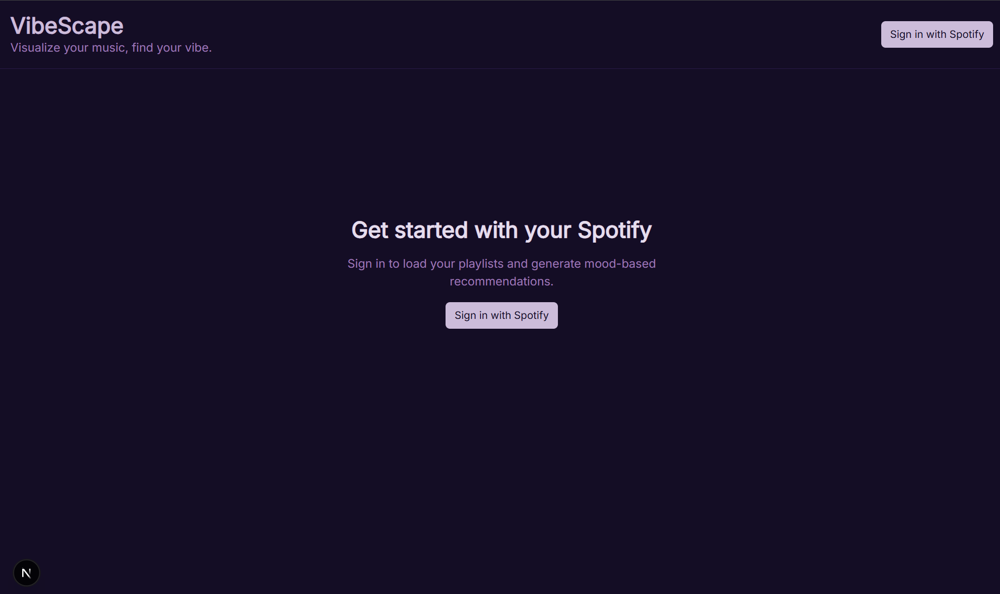

2) Loading state
- After sign‑in the app loads your library. This can take a moment depending on library size; you’ll see an animated loading indicator with rotating messages such as:

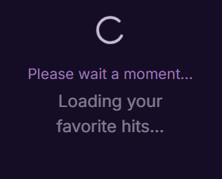

3) Song Map (default view)
- This is the main feature: playlists are large circles, songs cluster around them.
- Use the connection filters (right panel) to toggle:
  - Song ↔ Song (co‑occurrence)
  - Playlist ↔ Song (membership)
  - Playlist ↔ Playlist (shared songs)
- Use the slider to choose how many songs appear (Top or Random). Fewer songs render faster; large numbers can impact performance.

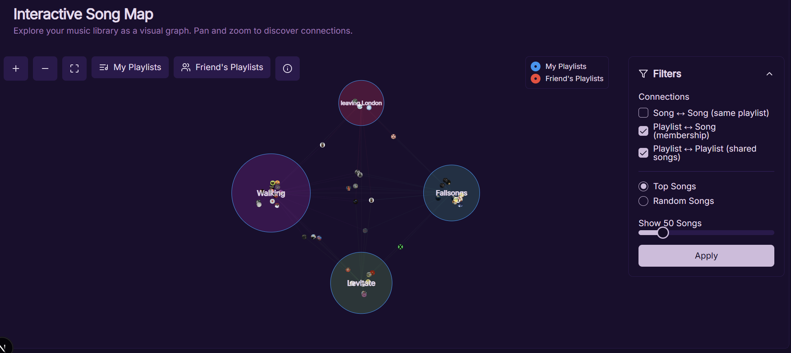

Here You can see I adjust the slider up and click apply to show more songs on the graph.

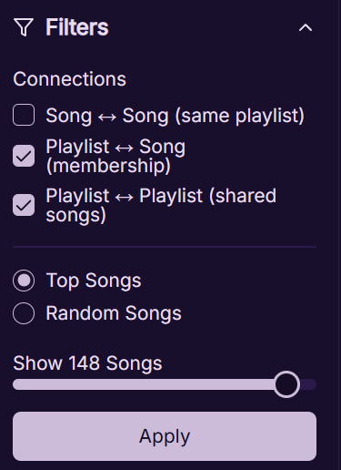

4) Select My Playlists
- Open the left sheet, search/sort, and check the playlists you want on the map.
- Click “Update Map” to apply.

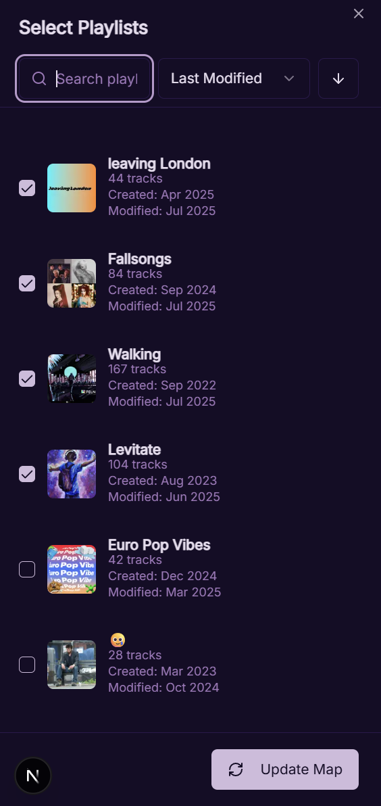

5) Friend’s Playlists
- Open the “Friend’s Playlists” sheet (left). Click a friend to reveal their public playlists, then check playlists to add.
- Click “Update Map”. You can now see overlap between your selections and theirs.
- Ownership: blue outline = yours; red outline = friend’s.

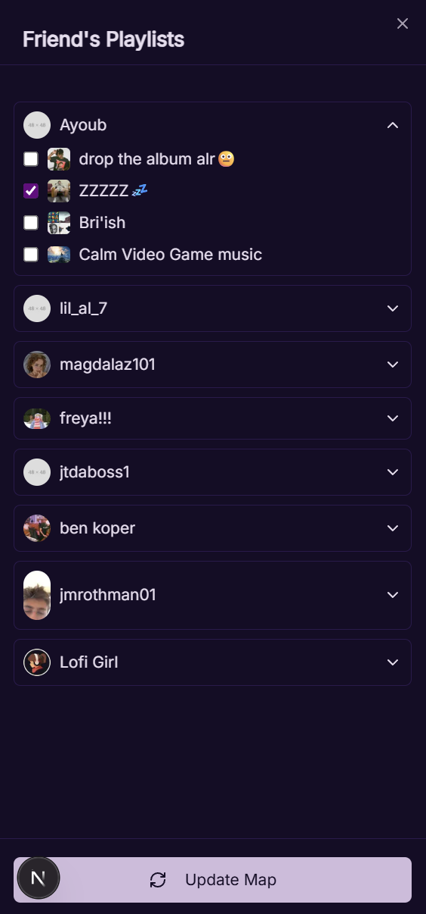

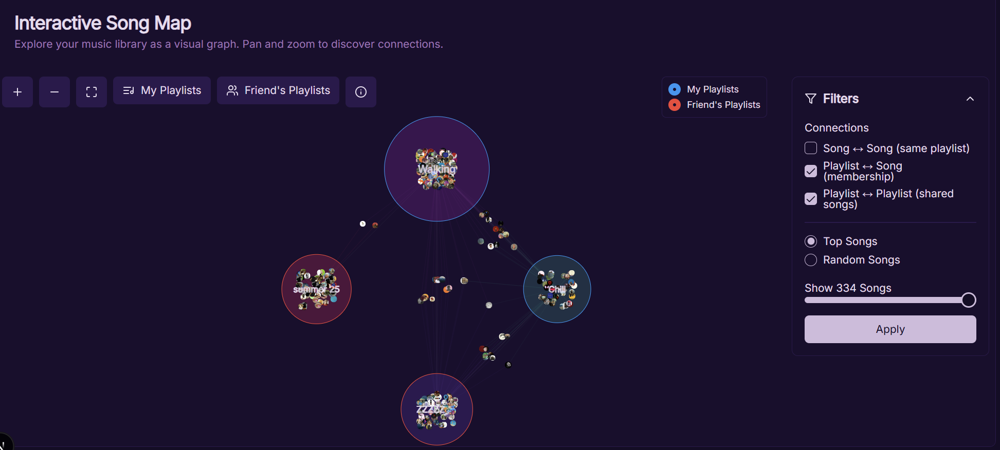

6) Playlist Chooser (AI)
- Switch to “Playlist Chooser”. Type any vibe (e.g., “late‑night coding focus” or “sunny road trip”). Click “Find Playlists”.
- While it loads, expand “How it works” to see the transparent algorithm steps.

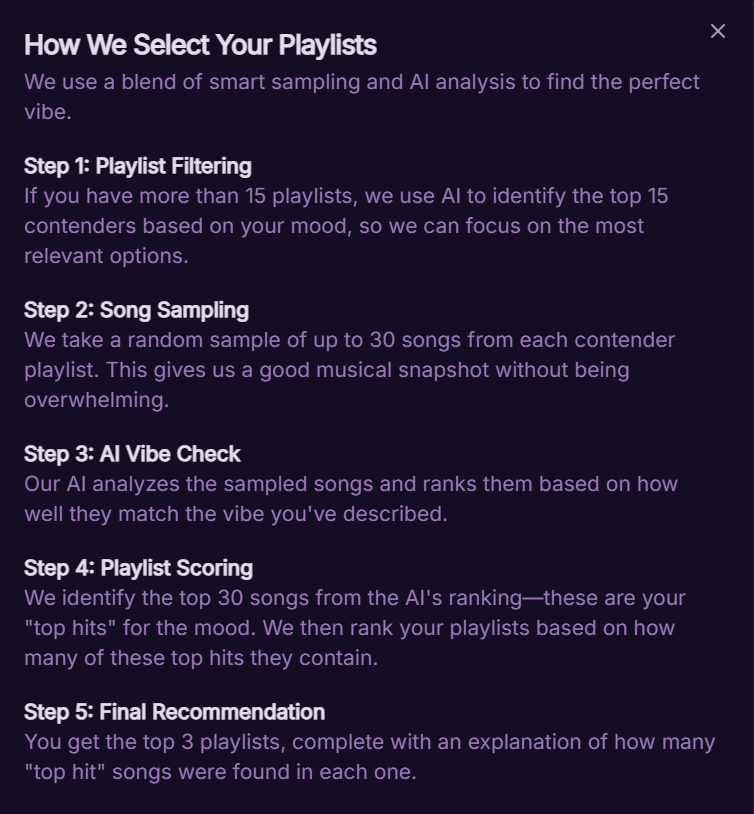

And here you will see that the AI has chosen the 3 that most closely match the vibe.

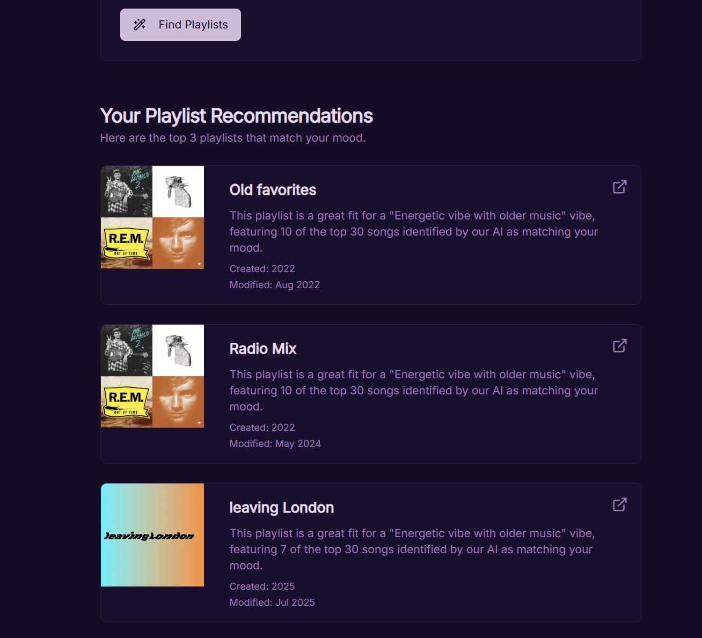

7) Top Songs
- Switch to “Top Songs” to see a ranked list using a personal score:
  - 50% Listening Boost (short‑term top tracks + recently played)
  - 35% Spotify Popularity (normalized)
  - 15% Library Frequency (across your playlists)
- Click a song to expand and view its score breakdown. Use the per‑page control and filter by a specific playlist (with images).
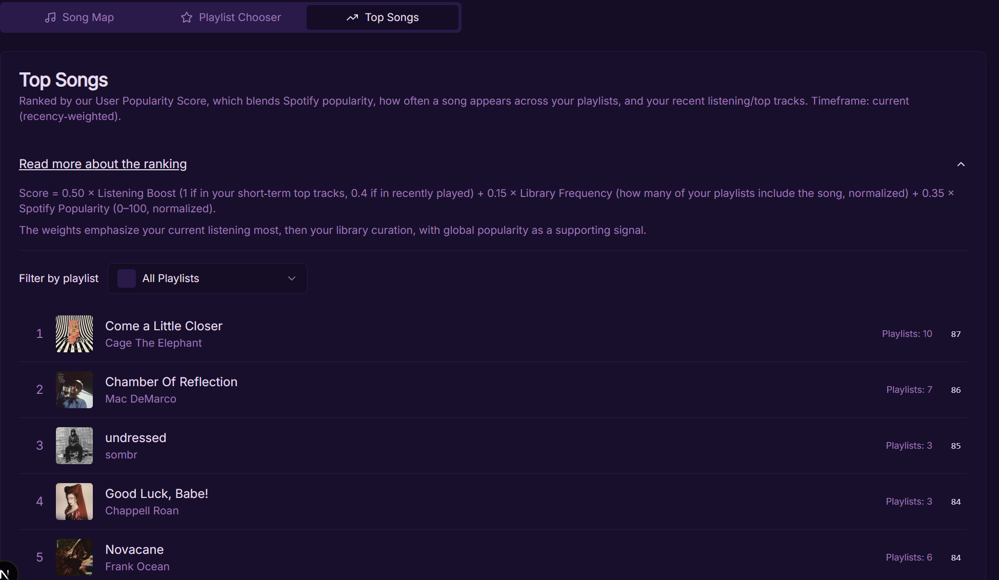
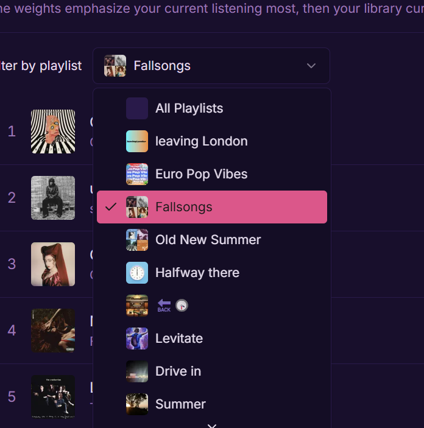
